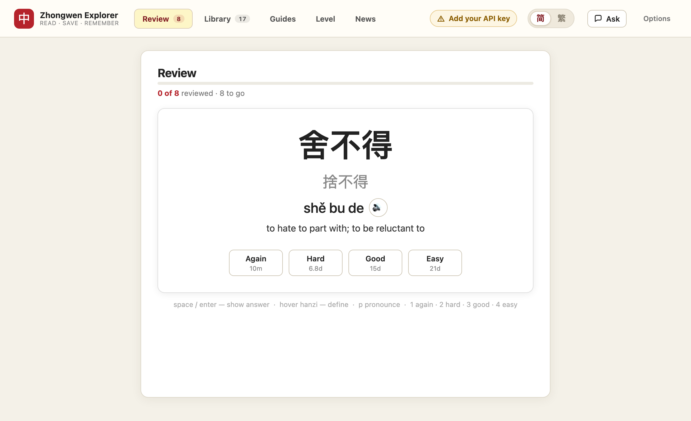
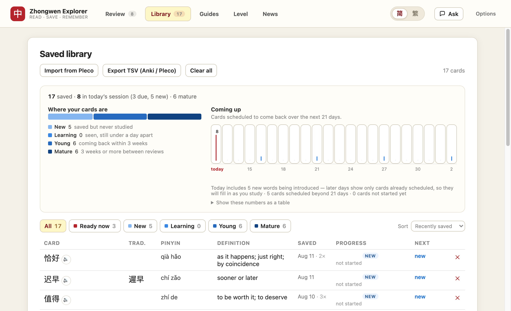
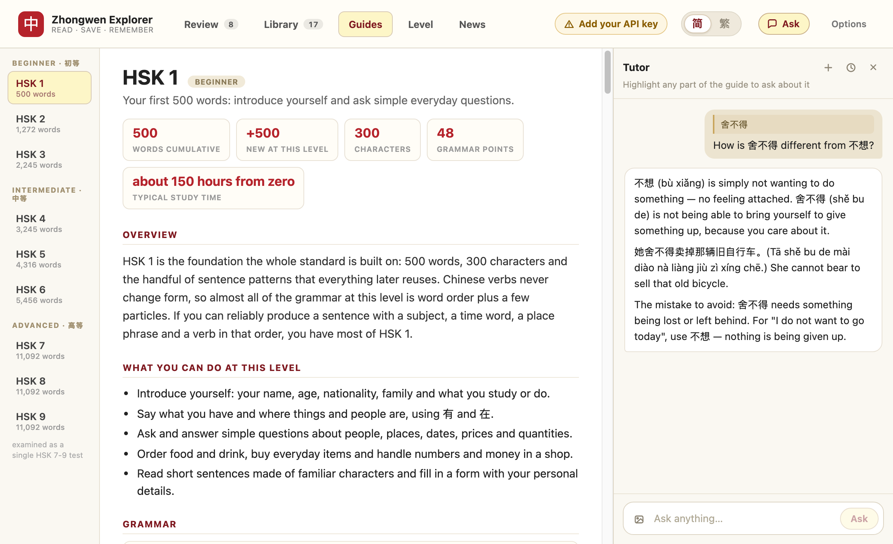
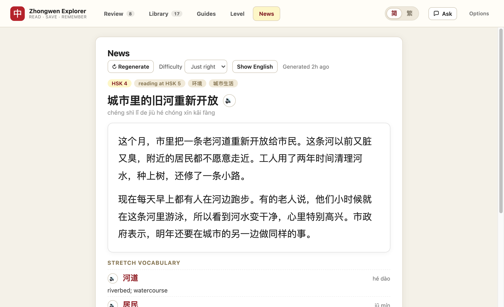
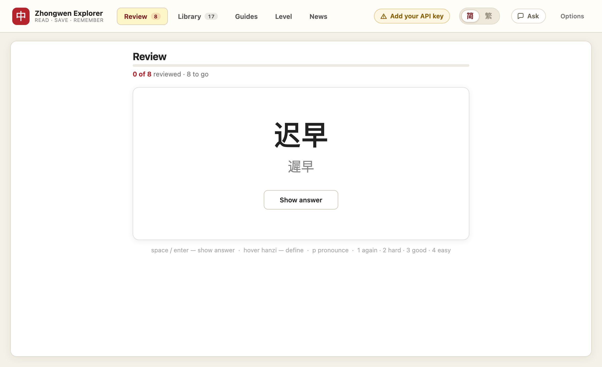
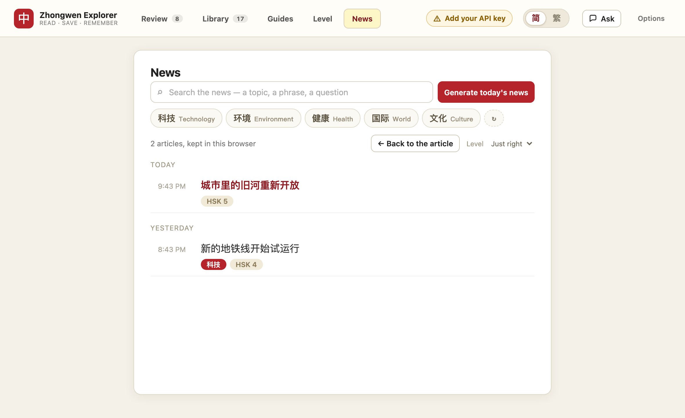

# Zhongwen Explorer

A Chrome extension in the spirit of [Zhongwen](https://chromewebstore.google.com/detail/zhongwen-chinese-english/kkmlkkjojmombglmlpbpapmhcaljjkde):
hover over Chinese text on any page and get an instant popup with the word,
tone-colored pinyin, and a short CC-CEDICT definition — plus the thing Pleco
does well that popup dictionaries usually don't: **real example sentences**
(Chinese + pinyin + English) so you can see the word in context.


Point at a word; the popup shows the word the character belongs to, every
CC-CEDICT sense, the characters underneath it, and — for a word already in your
deck — that you have saved it. Everything below is built on the same lookup.

|  |  |
| --- | --- |
| [](docs/shots/review.png) | [](docs/shots/library.png) |
| **Review** — cards you saved, scheduled with SM-2, with the example sentence and what each grade would do. | **Library** — every card, where it sits on the forgetting curve, and what is coming back when. |
| [](docs/shots/tutor.png) | [](docs/shots/news.png) |
| **Ask** — one chat that follows you from page to page, as a column of the app rather than a panel over it. | **News** — search the news or press a category, and read a passage written from the words you are actually studying. Every one is kept. |

*(Fake learner, invented deck, fixture passage and conversation — but real
pages: `node scripts/screenshots.mjs` takes these by driving the shipped code in
headless Chrome, so they cannot quietly stop being true.)*

## Features

- **Hover popup** — point at any Chinese text. Chunking is Pleco-style: the
  popup shows the dictionary word *containing* the hovered character (hover
  the 欢 in 喜欢 and you get 喜欢), found by bidirectional maximum-matching
  segmentation, with the hovered character's own sub-matches listed below.
  The matched word is highlighted on the page.
- **Interactive popup** — mouse into the popup, scroll it, select text in it.
  It sits below the active text line so you can keep moving left and right
  without running the cursor into it, flips above the line when there is not a
  readable amount of room below, and hides with a short grace delay so you can
  travel from text to popup. It is always clamped into the viewport: hovering a
  word near the bottom of a fixed-height page (the study guides, or any tab
  inside the dashboard) used to leave an unreadable 48px sliver hanging off the
  edge, which looked exactly like hovering doing nothing.
- **One popup, everywhere** — the same panel, with all of the above, opens on
  every surface the extension has: web pages, the study guides, the news
  digest, the saved library, and the *answer* side of
  a review card. Its one implementation lives in `extension/lib/popup.js`;
  pages differ only in how they find the character under the cursor. On a
  review card the question side stays silent on purpose — looking up the word
  you are being tested on is not a lookup, it is the answer.
- **Explorable definitions** — phrases include definitions for their individual
  characters. Hover Chinese embedded in a definition or example sentence to
  highlight the best phrase and open a compact nested definition; click it to
  promote that phrase into the main panel. Large headword characters remain
  directly clickable. Sticky back/forward controls (or arrow keys) retrace a
  flat, browser-style history, and a new choice after going back replaces the
  old forward path.
- **Placement interview** — a dozen turns of Mandarin back-and-forth that end
  in an HSK level, a chart of which levels held and which came apart, and every
  correction the examiner wrote down, each saveable as a flashcard. The
  questions lean on words your deck says you already know. See [Placement
  interview](#placement-interview).
- **Example sentences** — up to 15 Tatoeba sentences per word (default 8),
  shortest first, with auto-generated pinyin and English translation.
  Hovering 是 won't show sentences that only contain 是否.
- **Related words + full senses** — definitions display every bundled
  CC-CEDICT sense separately. A ranked related-word section combines direct
  dictionary references, shared meaning, and useful word-family compounds;
  the three strongest suggestions appear at the bottom with pinyin and
  definitions and open in the same back/forward history when clicked.
- **Tone colors** — Pleco-style (1 red · 2 green · 3 blue · 4 purple ·
  neutral gray) on both hanzi and pinyin.
- **Selectable Mandarin pronunciation** — natural/enhanced voices rank above
  compact voices, with a voice picker, speed control, and preview in Options.
  Speaker buttons play words, related terms, full sentences, saved-library
  entries, and review cards. Press `p` for the current popup word; use
  Shift-click (or Shift+`p`) for extra-slow playback.
- **Traditional or simplified, one click** — a **简 / 繁** toggle sits in the
  navbar on every page. It picks which script leads in the hover popup, on your
  review cards, and in the saved library, live: flipping it repaints the card
  you are looking at rather than waiting for the next one. Both forms are
  always indexed and both stay on screen — the one you did not choose moves to
  the secondary line (and the library's second column renames itself to match),
  so a card still teaches both. Prose that exists in only one script — a study
  guide, a generated news passage — is **converted**, by word rather than by
  character, because a character table cannot be right about both 头发 (頭髮)
  and 发现 (發現); segmenting first and swapping whole dictionary entries can.
  It was previously a dropdown buried in Options that only the popup honoured,
  which meant a traditional reader was studying the simplified form of their
  own cards on every other surface.
- **Save words** — click the sticky **☆ save** button at the top of the popup
  or press `s` (`c` copies, `Esc` closes). Every save control is a toggle: a
  word already in your vocab list shows **✓ saved** instead of offering to
  star it again, and clicking (or `s`) takes it back out — a removal that
  syncs to your other devices rather than reappearing on the next pull.
  Re-saving bumps a counter so you can see which words you keep looking up.
  Homographs are ranked with the everyday sense first, and each dictionary
  entry has its own ☆/✓ control when you need to save a specific
  pronunciation and definition.
- **Import your Pleco deck** — the words you have already looked up are a far
  better starting deck than anything this extension could guess. **Import from
  Pleco** on the saved library reads both of Pleco's export shapes (Cards →
  Export Cards, either the XML flashcard file or the tab-separated text one),
  and nothing is added on picking the file: every headword is resolved against
  CC-CEDICT and shown as a list you scroll, drop rows from, and confirm. Cards
  already in your library never appear in it. An imported card comes out
  indistinguishable from one saved off a web page — real definitions, both
  scripts, tone-coloured pinyin — with Pleco's own pinyin and definition kept
  as the fallback for a word the dictionary has never heard of (a name, slang,
  something from a user dictionary) rather than a reason to drop it.
- **Word history page** — every saved word with date, save count, per-row
  delete, and TSV export (`headword[traditional] <tab> pinyin <tab> definition`
  — Pleco's flashcard import format, also mappable in Anki). Each row also
  shows where that card sits on the curve: a strength meter, its stage, the
  interval it has reached, its reps, lapses, ease, and when it comes back. The
  library can be filtered by stage (or "ready now") and sorted by next review,
  weakest, strongest, or most looked up.
- **Spaced repetition** — a review page with SM-2 style scheduling
  (Again/Hard/Good/Easy, keys 1–4, space to reveal). Cards show hanzi on the
  front; pinyin, definition, and a real example sentence on the back.
  Scheduling works in study days that roll over at 4am, credits overdue time
  when you get a late card right, and **fuzzes** each interval by a per-card
  amount so words saved together stop arriving together.
- **A queue that doesn't give away its own answers** — the day's cards are
  shuffled with a per-day seed and then *spaced*: cards sharing a character or
  a pinyin syllable (儿童 and 童, 是 and 事) are pushed apart, so the card you
  just saw can't prime the next one.
- **"Done for today" that says what it means** — the end-of-session screen
  reports what you finished, what today's limits are deliberately holding back
  and why, when the next card is due, a 14-day forecast of what is coming, and
  where the whole collection sits on the curve — with a one-click way to pull
  more cards forward. New cards per day and the daily session cap are settings
  (default 15 and 60); the limits are per *day*, so reloading the page no
  longer hands you another batch, and the Review tab's badge now counts what a
  session would actually serve.
- **Save anything you can point at** — a card does not have to be a word the
  popup looked up. Highlight any Chinese on any page — a phrase in an article,
  a clause you half-understood, one sentence of a study guide — and a small bar
  appears offering **☆ Save**. Highlight a paragraph instead and the same bar
  tells you why it will not: a flashcard is a word, a phrase, or one sentence,
  and reviewing a paragraph teaches you to recognise its shape rather than its
  language. What may become a card is decided in one place
  (`extension/lib/cards.js`) for every surface, so a word saved by highlighting
  is the same card as the same word saved from the popup — not a duplicate.
  Untranslated text still gets a back — and if it is a sentence no dictionary
  can translate, the AI writes one. See [Saving from anywhere](#saving-from-anywhere).
- **Sentence flashcards** — each example has a **☆ save sentence** control,
  which reads **✓ sentence saved** once the sentence is in your list and
  removes it when clicked again.
  Sentence cards review the complete Chinese sentence on the front, then reveal
  its full pinyin, English translation, and native pronunciation. On the
  revealed answer, hover any character to highlight and define the smartest
  containing phrase; the compact definition popup can pronounce or save it.
- **HSK study guides** — a written guide for every level, HSK 1 through 9
  (`hsk.html`): the word and character counts from the standard, what you can
  do at that level, the grammar points it introduces with worked examples,
  themed core vocabulary, a reading passage written at level, the mistakes
  English speakers actually make, and how the exam is structured. All of it is
  bundled and works offline, every Chinese character is hoverable, and
  readings are generated by the same engine that annotates the example corpus
  rather than stored alongside the text. **Everything in a guide is savable**:
  a ☆ sits beside every worked example, every vocabulary item, and every
  *sentence* of the reading passage — the passage is offered one sentence at a
  time rather than one paragraph at a time. Stars you have already used stay
  lit, so a level shows at a glance what of it is in your deck.
  See [HSK study guides](#hsk-study-guides).
- **One tutor, one chat, every page** — a dictionary entry tells you what a
  word means, not when a native speaker would reach for it. The same panel
  slides out of the right edge of every surface that has Chinese on it: the
  study guides, the news passage, your saved library, and the **answer side of
  a review card**. It is literally one conversation, not one per page or per
  card: ask about a word in the library, move to review, and you are still in
  the same chat, so your last question is context for the next. Earlier chats
  are in a list you can navigate (the clock button) and reopen. **Highlight
  anything and ask about it** — the selection travels with the question, so the
  answer is about that exact text rather than the page in general. On a
  flashcard it also gets the card itself: the word, its reading, the gloss, the
  example on screen, and how many times you have forgotten it. Every question
  also carries **who is asking** — your level and what your deck says you are
  drilling, know, and keep failing — so answers are pitched at you and built out
  of words you already hold, and it can **search the web** when the answer
  depends on something outside the dictionary. **Ask** is a switch in the navbar
  and the drawer pushes the page aside rather than covering it; paste a photo of
  a sign or a menu into the box to ask about Chinese that is not on the screen
  at all.
  See [Asking questions](#asking-questions).
- **One app, one navbar** — Review, Library, Guides, News, and Settings all
  wear the same top bar, with live due/saved counts on the tabs that have them.
  It is a single component (`extension/lib/shell.js` + `extension/shell.css`)
  rather than a nav hand-written into each page, which is what let five copies
  drift into five different link lists — one of them still advertising a page
  that had been deleted. Settings in particular used to look like a different
  product; it is now a destination in the app like any other.
- **New-tab learning dashboard** — Chrome's New Tab page opens directly to
  spaced-repetition review. There the same navbar's tabs swap iframes instead
  of navigating, so the header and the counts stay put while you move between
  views, and each page hides its own copy of the bar when embedded rather than
  stacking a second one. Settings opens in its own tab so the dashboard is
  never lost.

  

- **AI news digest (News tab)** — a short Mandarin passage written just for
  you, on demand. Click **Generate** and the sync Worker builds a profile from
  your deck (which words you're learning, which you keep failing, and how well
  you're recalling them), pulls *current* news headlines on the topics your
  saved words point to, and an LLM synthesizes an original passage **matched to
  your level** — with a stretch-vocab glossary, an English summary to
  self-check, tap-to-hear audio, and links to the real sources it drew from.
  **Search it like a news site**: type a topic, a phrase or a question in either
  language, or press one of the **categories the model suggests for you**,
  labelled in Chinese the way a Chinese news site labels its sections. A quiet
  **Level** control dials the next article easier or harder. **Hover any
  character in the passage** for the same phrase-aware popup you get on any web
  page — definition, example sentences, per-character breakdown, related words,
  and one-click save. See [AI news digest](#ai-news-digest) for setup.

- **Every article is kept (Past articles)** — generating one no longer
  overwrites the last. Each passage is filed by the moment it was written, and
  **Past articles** lists them under the day — Today, Yesterday, then dates —
  with the headline, the topic you searched for and the level it was pitched
  at. Open any of them and it comes back whole. The archive lives in this
  browser and never leaves it.

  
- **Themes** — classic Zhongwen yellow, light, or dark.
- **Toggle** — click the toolbar icon to switch the dictionary on/off (badge
  shows ON). History and review pages are linked from the options page.

## Install

Two minutes, no build step, no account. Everything in the **Features** list
above except the four AI features works the moment it loads.

1. Download this repo — **Code → Download ZIP** on GitHub and unzip it, or:

   ```sh
   git clone https://github.com/Siunami/chinese-chrome-extension.git
   ```

   The dictionary and example-sentence files are committed, so there is
   nothing to build. (If you ever want to regenerate them from the upstream
   sources, see [Data licenses](#data-licenses) and run
   `node scripts/build-data.mjs`.)

2. Open `chrome://extensions`, turn on **Developer mode** (top right), click
   **Load unpacked**, and select the `extension/` folder inside what you just
   downloaded.

3. Open `test-page.html` in Chrome and hover the Chinese text. You should get a
   popup with pinyin, definitions, and example sentences.

That's the whole install. Chrome will warn you about developer-mode extensions
on each restart; that is normal for an extension loaded from source rather than
the Web Store. Keep the folder where it is — Chrome loads it from that path.

### Turning on the AI features (optional, one API key)

The news digest, the study-guide tutor, and English backs for sentences the
dictionary cannot translate are written by a language model. They run on
**your own API key**, so nobody is paying for anyone else's usage:

1. Get an [OpenAI API key](https://platform.openai.com/api-keys) (a fal.ai key
   also works). It starts with `sk-`.
2. Open the extension's **Options** page — the puzzle-piece menu in Chrome's
   toolbar → Zhongwen Explorer → ⋮ → Options — and paste the key under
   **AI features**.
3. That's it. Open a new tab and try **News → Generate**, sit the **Level**
   placement interview, or open the HSK guides and ask the tutor a question.

**Where the key goes.** It is stored in your browser's local extension storage
and sent — only on those model-backed requests — to the sync Worker, which
forwards it to OpenAI and never writes it to a database or a log. If you would
rather not route a key through a Worker somebody else operates, [run your own
Worker](#phone-sync-flashcards-on-your-phone) (it's ~20 lines of `wrangler` and
a free Cloudflare account) and point the extension at it; that is the same code
in `worker/`. Either way you can revoke the key from your OpenAI dashboard at
any time, and every non-AI feature keeps working without one.

**Cost.** Small. A news digest is one model call and is cached for 12 hours; the
tutor and the translator are short calls with hourly caps (40 and 200 per hour).
Nothing generates on a page load — only when you click.

**If the key is missing or wrong, the app says so.** Four features run on a
model, and each used to find out about a missing or rejected key by failing
inside itself, with a sentence only that page showed — a learner who had never
pasted one met "could not reach the examiner" and had nothing to act on. The
state belongs to the app now (`extension/lib/aistatus.js`), so the navbar wears
an amber **Add your API key** — or **API key was rejected**, once a provider has
actually refused it — on every page until it is dealt with, and pressing it
lands on the key field itself rather than the top of the settings page.

Two things it deliberately does *not* do. It never nags somebody whose
deployment pays for its own calls: `/api/health` reports whether the server has
a provider key and whether it expects the caller to bring one, which costs no
model call, and a server that supplies its own raises nothing. And it never
blames the key for something else — being offline, or a provider having a bad
afternoon, leaves the bar alone. Only a provider actually answering 401/403
(wrong key) or 429 (out of quota) does, which the Worker reports as
`code: "provider_auth"` / `"provider_quota"` rather than as a generic 502.

A fifth state uses the same slot: **Sync server is out of date**. Every `/api/*`
route the Worker knows answers 401 without a token, so a 404 means the deployment
is older than the extension calling it. That is how `/api/ask` shipped, was
documented, and 404'd in the browser — and then `/api/placement` did the same
thing, reaching the screen as the word "not found" beside a Try again button
that could never work. Run `node scripts/worker-smoke.mjs` after `wrangler
deploy`, and the app will tell you if you forget.

### What runs where

| Feature | Needs a key | Needs the Worker |
| --- | --- | --- |
| Hover popup, dictionary, example sentences, HSK guides | no | no |
| Saving words, flashcards, SRS review | no | no |
| Phone sync (the PWA) | no | yes |
| News digest, tutor, sentence translation | **yes, yours** | yes |

There is no paid speech service anywhere in this: reading words aloud uses
`chrome.tts`, which is free and runs on your machine.

## Phone sync (flashcards on your phone)

Your flashcards can sync to a small installable web app (PWA) so you can
review on your phone. Everything runs on your own free Cloudflare account —
no third-party service, no login: the extension generates a private pairing
code, and your phone joins by scanning a QR code.

**How it works.** A Cloudflare Worker (`worker/`) stores cards in a D1
database and serves the phone app (`pwa/`) from the same origin. All three —
extension, Worker, and app — share the exact same merge rules
(`extension/lib/merge.js`), so reviews made on the phone and saves made in
the browser both survive, even when made while offline. Deletions propagate
as tombstones; reviewing or re-saving a card *after* deleting it on the other
device resurrects it.

The app also has the extension's tap-to-define ability: after revealing an
answer (or from any word-list row), tap a hanzi to open a detail sheet with
every dictionary entry, numbered senses, example sentences, a per-character
breakdown, and related words — and save new words straight into the deck. Its
save controls toggle the same way the extension's do: a word already in the
deck shows a check, and tapping it removes the card. It fetches the same
dictionary the extension bundles (a one-time ~13 MB download, cached for
offline use).

**You do not have to deploy anything.** The extension ships pointed at a
running Worker (`DEFAULT_SERVER_URL` in `extension/lib/sync.js`), so pairing is
one click in Options. Deploy your own if you would rather your cards and your
API key not pass through someone else's account — same code, ~2 minutes:

```sh
node scripts/sync-shared.mjs              # copies shared libs + dictionary into pwa/
cd worker
npx wrangler d1 create zhongwen-sync      # paste the id into wrangler.jsonc
npx wrangler d1 execute zhongwen-sync --remote --file=schema.sql
npx wrangler deploy                       # prints your https://….workers.dev URL
```

Then either paste that URL into the options page under **Phone sync**, or edit
`DEFAULT_SERVER_URL` so every surface uses it by default. If you are the only
person pairing with your Worker, you can drop `REQUIRE_USER_KEY` from
`wrangler.jsonc` and put the model key in `wrangler secret` instead of the
options page — see [AI news digest](#ai-news-digest).

**Pair:** open the extension options page, click **Enable phone sync** (the
default server URL is prefilled), and scan the QR code with your phone's
camera. The app opens already paired; add it to your home screen for
the full-screen offline experience. (You can rotate or revoke the code from
the options page at any time — anyone with the code can read and change your
cards, so treat it like a password.)

Local development: `node scripts/sync-shared.mjs`, then in `worker/` run
`npx wrangler d1 execute zhongwen-sync --local --file=schema.sql` once and
`npx wrangler dev`; point the options-page server URL at
`http://localhost:8787`. `node scripts/sync-smoke.mjs` exercises the API and
`node scripts/pwa-e2e.mjs` click-tests the app in headless Chrome.

## Tests

Unit and protocol tests are plain Node scripts with no dependencies —
`node tests/merge.test.mjs`, and so on for each file in `tests/`. Three are
worth calling out: `tests/hsk.test.mjs` validates the study-guide content
against the published HSK figures and the bundled dictionary,
`tests/cards.test.mjs` pins down what may become a flashcard — and checks that
every sentence of every bundled reading passage, every worked example and every
vocabulary item really does resolve to one, so no ☆ in a guide is a promise the
resolver cannot keep — and `tests/ask.test.mjs` drives the real Worker module
to check the tutor's guards, its rate limit, that a highlighted passage
actually reaches the model prompt, that the learner's level and deck reach it
too (clamped, so a large deck cannot become a large prompt), that the web-search
tool is offered and that a provider refusing it still answers, and that an
attached image reaches the model as an image — with the type, size and count
caps refusing a bad one without spending one of the learner's forty questions. `tests/translate.test.mjs` and `tests/translate-sweep.test.mjs` cover the two
halves of card translation — the endpoint's guards, budget and clamping, and
the client's decisions about what to send, what to retry, and what to leave
alone when a request fails. `tests/aistatus.test.mjs` covers the thing that
turns a broken API key into something the learner can act on: that `/api/health`
reports a deployment's key situation without spending a model call, that a
provider refusing a key is told apart from a provider having a bad afternoon on
every endpoint (including the one that would otherwise hide it behind a cached
digest), and — the property that matters most — that a deployment paying for its
own calls raises no banner at all. `tests/placement.test.mjs` covers the placement
interview from both ends — the ladder driven through the sequences of marks a
real run produces (every shape of learner terminates, inside the turn cap; a
level held above one that came apart is read as a gap rather than a placement;
an unmarked turn is not scored as a zero), and the endpoint's guards, its
separate hourly budget, and the two things the Worker must not let the model
do: pick a level the ladder ruled out, and close an interview that has just
started. `tests/provider-key.test.mjs` covers the thing that
makes a shared deployment safe to hand to other people: that a caller's key is
what reaches the provider, that it replaces the Worker's own credentials rather
than merging with them, and that with `REQUIRE_USER_KEY` set a keyless request
is refused even though the Worker has a usable key of its own.

`node scripts/worker-smoke.mjs [url]` checks a **deployed** Worker rather than
the source. Every other test imports `worker/src/index.js` and runs it in Node,
which passes happily while the live Worker serves an older bundle — which is
exactly how `/api/ask` came to be written, tested, documented, and then 404 in
the browser. It sends no credentials and no user data: a route that exists
rejects an unauthenticated POST with 401, and a route the deployment has never
heard of falls through to the catch-all 404. Run it after `wrangler deploy`.

`node scripts/extension-smoke.mjs` is the integration test. Chrome no longer
honours `--load-extension`, so `scripts/harness.mjs` serves `extension/` over
http and injects a small `chrome` shim before any page script; only the
transport is faked, and the real background handlers run against the real
dictionary in Node. It then drives headless Chrome to check
that every page boots clean, that the guides render with generated readings,
that a review card stays silent on the question and gives the full popup on the
answer, that every dashboard tab keeps the top bar and draws no second header,
that a whole placement interview runs from the invitation to the report and
lands on the level the scripted examiner was playing — with the ladder, the
transport and the chart all having to agree for it to pass, and a correction
from the report saving as a real card,
and that a trusted pointer move over 喜欢 on an ordinary web page resolves the
containing word. Saving is driven the same way: a star in a guide saves the
sentence beside it, a real drag over a phrase on a web page raises the bar and
saves it, a drag over a paragraph gets the refusal instead of a card, and a
drag over English raises nothing at all. It also drives the tutor end to end: the drawer is refused on
the question side and offered on the answer, typing `1` into the question box
does not grade the card as Again, the card's own details reach the request
the Worker receives, the drawer opens as a column beside the page rather than
over it — with the page's scrollbar inside its own column and no document
scroll left behind the chat — and a pasted image is attached, shrunk, kept with
the question and actually sent. Highlight-to-ask is driven with a real press-drag-release
rather than a scripted selection — a synthetic `Selection` passes even when
nothing on the page is actually selectable. The popup lives in a closed shadow
root, so its contents are read through CDP's piercing traversal rather than a
test-only hook.

`node scripts/screenshots.mjs` takes the pictures at the top of this file
through the same harness, and writes them to `docs/shots/`. The learner in them
is invented — a deck of everyday words at a plausible spread of ages, one
fixture passage, one fixture conversation — but the pages are the shipped ones
rendering the real dictionary, so a screenshot cannot drift away from what the
app does without the run that produced it drifting too. Rerun it after anything
that changes how a page looks.

## AI news digest

The New Tab **News** tab writes you a short, current-events Mandarin passage
pitched just above your level. It runs through the same Worker as phone sync,
on the API key you pasted into the extension's Options page — see
[Turning on the AI features](#turning-on-the-ai-features-optional-one-api-key).
No key is ever committed to this repo or shipped in the extension.

**How it works.** Click **Generate**. The extension builds a compact profile
from your deck (`extension/lib/profile.js`): counts, average SM-2 ease, up to
60 recently saved words, and up to 25 words you keep failing (≥2 lapses or
ease ≤1.8 — i.e. how well you're actually remembering them). That profile goes
to `POST /api/news` on your Worker, authenticated with the same private
pairing token as sync. The Worker then: (1) asks the model to estimate your
level as an HSK band and infer 2-4 topics + a few Chinese search queries from
your vocabulary; (2) pulls **real, current headlines** for those queries from
Google News RSS (keyless, done in the Worker); (3) asks the model to synthesize
an original passage from them — with a stretch-vocab glossary, an English
summary, and links to the actual articles it drew from. No page content or
browsing history is ever sent — only word statistics, and the source links are
always the real articles used (never model-authored URLs).

**Search it, or browse it.** The page is a news reader, so the way in is a
search box: type a topic, a phrase or a whole question, in Chinese or English,
and that replaces the inferred themes — the planner turns what you typed into
Chinese search terms, and the passage is written about what comes back. Above
it sits a row of **categories the model picked for you**, labelled the way a
Chinese news site labels its sections (科技, 环境, 体育) with a small English
gloss underneath: 2-4 drawn from what your saved words say you care about, the
rest the standard sections so there is always somewhere to go. Suggesting them
is a model call, so it waits for a click like everything else here — after that
they are cached for a week (`POST /api/news/categories`).

Categories are **sections, not subjects** — broad enough that a news site has
something under them most days. Pressing 音乐 and being told there is no music
news is absurd, and it happened: the planner had narrowed that chip to
华语乐坛 新歌发布, which genuinely had nothing under it that day. Two things stop
it now. The plan's first query has to be the topic in its plainest words (音乐,
not 华语乐坛 新歌发布), and a search that still comes back empty is retried with
the bare words you pressed or typed before anything gives up. If a topic really
has no current news, the page says so and names it, rather than quietly handing
you the front page under the label you asked for.

**Every article is kept.** Generating one used to overwrite the last. Now each
one is filed in `newsHistory` (chrome.storage.local, newest first, 60 deep) and
**Past articles** lists them under the day they were written — Today,
Yesterday, then dates — with the headline, the topic you searched for and the
band it was written at. Open any of them and it comes back exactly as it was,
tutor and hover-to-define included. The archive is per-browser, and never
leaves it: the Worker still keeps only the single most recent digest per user,
as the cache that stops a burst of clicks running up your bill.

**The level dial.** The news is the news first: **Level** (Easier / Just right
/ Harder) sits at the quiet end of the toolbar and shifts the target HSK band
down or up for the *next* article you generate — changing it spends nothing.
The prompt treats the band as a dial rather than a ceiling. An earlier version
made calibration "the most important requirement" and bought readability by
flattening the story into something that was no longer really the news; it now
says what happened, in natural Chinese, and where a story genuinely needs a
hard word it uses the right word and puts it in the glossary.

**Why the Worker does the searching.** Grounding is done in the Worker for
*every* provider rather than relying on a model's own web-search tool — in
testing, OpenAI's `web_search` tool frequently declined to search and fabricated
plausible-looking source URLs. Pulling headlines ourselves guarantees the
passage is grounded in genuinely current news with real, verifiable links.

### Where the key comes from

The Worker resolves credentials per request (`resolveModel` in
`worker/src/index.js`), which supports two ways to run it:

**Shared** — `REQUIRE_USER_KEY: "true"` in `wrangler.jsonc`, which is how this
repo deploys. Every AI request must carry the caller's own key in an
`x-provider-key` header (the Options page collects it; `extension/lib/sync.js`
attaches it). The key is used for that one request and never stored, never
logged, and never merged with the Worker's own secrets — so a keyless request
is refused with a 503 telling the user where to paste a key, even when the
Worker has a perfectly good key of its own. Leave this on if anyone but you
pairs with your deployment.

**Private** — drop `REQUIRE_USER_KEY` and set one of the secret groups below.
Every paired device then gets the AI features with no key of its own. A
caller-supplied key still takes precedence, so one deployment can do both.

`tests/provider-key.test.mjs` pins all of this down, including that a caller's
OpenAI key cannot fall back onto the owner's Azure group.

**Choose a model provider** (used only to plan topics + write the passage — no
web tool required). Set **one** of these secret groups; the Worker prefers
OpenAI, then Azure OpenAI, then fal.ai. Users bringing their own key can supply
an OpenAI or a fal.ai key (Azure needs three values, so it is server-side only).

```sh
cd worker
npx wrangler d1 execute zhongwen-sync --remote --file=schema.sql   # adds the news cache table (idempotent)

# Option A — OpenAI:
npx wrangler secret put OPENAI_API_KEY            # (optional) OPENAI_MODEL, default gpt-4o

# Option B — Azure AI Foundry / Azure OpenAI (a GPT deployment):
npx wrangler secret put AZURE_OPENAI_KEY          # key from the Azure OpenAI resource
npx wrangler secret put AZURE_OPENAI_ENDPOINT     # https://<resource>.openai.azure.com
npx wrangler secret put AZURE_OPENAI_DEPLOYMENT   # your deployed model name, e.g. gpt-4o
#   (optional) AZURE_OPENAI_API_VERSION           # defaults to "preview"

# Option C — fal.ai (reuses a FAL_KEY you may already have):
npx wrangler secret put FAL_KEY                   # (optional) FAL_MODEL, default google/gemini-flash-1.5

npx wrangler deploy
```

Two vars worth knowing about, both optional and both on the tutor: images are
sent to the model as images on OpenAI and Azure (fal's `any-llm` is text-only,
and the tutor is told to say so rather than answering as if the picture were not
there), and `ASK_WEB_SEARCH=false` turns off the tutor's ability to look things
up on the web. Deploy after changing either — a Worker serving an older bundle
accepts a question with a picture attached and silently drops it, which the
extension will now tell you about rather than leaving the model to apologize.

Verified-working `FAL_MODEL` values on fal's `any-llm`: `google/gemini-flash-1.5`
(default, cheap), `openai/gpt-4o`, `openai/gpt-4o-mini`. If fal rejects one with
a 404 "no endpoints" error, pick another from your fal dashboard.

**Cost control.** Each digest is cached per user in D1 for 12 hours, and the
Worker refuses to call the model more than once per 10 minutes per user.
Generation only ever runs on an explicit **Generate** / **Regenerate** click —
never on tab open — and the extension caches the last digest locally too.

Then open a new tab, click **News → Generate**, and (if you haven't enabled
phone sync) click **Enable news digest** — it provisions the same private
token sync uses. With no key available from either side, the endpoint returns a
clear 503 saying which one is missing and everything else keeps working. Local
dev: put the same variable names in `worker/.dev.vars` (gitignored).

**Nothing secret lives in this repo.** Keys are either `wrangler secret` values
(server-side, never in `wrangler.jsonc`) or the user's own key in their
browser's extension storage. `.gitignore` covers `worker/.dev.vars` and
`worker/.wrangler/`; the D1 `database_id` in `wrangler.jsonc` is not a secret,
but it only resolves inside the account that created it, so a fork replaces it
with the id its own `wrangler d1 create` prints.

## HSK study guides

The **Guides** tab (`hsk.html`) is a written course map: one guide per level of
the HSK 3.0 standard (国际中文教育中文水平等级标准, 2021), levels 1 through 9.

Each guide carries the level's published word/character counts, what you can do
at it, the grammar points it introduces (pattern, explanation, worked examples),
themed core vocabulary, a reading passage written at level, the mistakes English
speakers actually make, and how the exam works. Levels 7-9 are one syllabus and
one exam in the standard, so those three guides share the band's figures and
differ by capability rather than by invented per-level counts.

The guides are bundled content — they work offline, cost nothing to open, and
never call a model. Two details are worth knowing:

- **No readings are stored with the text.** Every Chinese string is annotated
  at display time by the service worker's `sentencePinyin` — the same function
  that annotates the bundled Tatoeba corpus. There is one source of truth for
  readings, so a guide and the hover popup cannot disagree.
- **Everything is checked against the dictionary.** `tests/hsk.test.mjs`
  validates the schema, pins the counts to the published standard, and asserts
  that every listed vocabulary word is a real CC-CEDICT headword — a word the
  popup could not define would otherwise ship silently.

### Saving from a guide

Every worked example, every vocabulary item, and every sentence of the reading
passage carries its own ☆. The passage is deliberately savable one sentence at
a time: a paragraph is not a flashcard. A star that is already lit means that
card is in your deck, and clicking it again takes the card back out.

Vocabulary items save as **word** cards built from the dictionary, not from the
guide's short gloss — that is what makes 老师 saved here and 老师 saved from a
hover popup the same card rather than two. Examples save as **sentence** cards
with the guide's own English on the back.

### Asking about the guide

The tutor slides out of the right edge, as it does everywhere else. Select any
part of a guide — a sentence in the passage, a grammar box, a single word — and
a bar appears offering
**Ask about this** (beside **☆ Save**); clicking it points the question at that
exact text. See [Asking questions](#asking-questions) for how it works
everywhere else.

## Placement interview

The **Level** tab (`placement.html`) works out where you are on the HSK scale
by talking to you, and then keeps the answer.

It is an interview, not a quiz. Roughly a dozen turns: the examiner writes a
task in Mandarin, you type back, and it marks what you wrote before setting the
next one. The tasks vary — answer a question about your life, react to a
situation, retell what was just said, translate one short sentence, finish a
sentence that was started. Nothing is corrected while you are in it; every
correction waits until the end.

**How the number is arrived at.** The shape is the one oral proficiency
interviews use: open somewhere comfortable, push upward until the tasks stop
being answerable, then come back and confirm the highest level actually
sustained. Each answer is marked out of three for understanding the task and
out of three for the Chinese that came back; a level counts as *held* at about
two thirds of the available marks and *lost* below about a third. Your
placement is the top of the range you held **before the first level that came
apart** — HSK is cumulative, so sustaining 5 after losing 3 is a gap, not a
level 5. Confidence is reported alongside it, and is only ever high when the
run found both a level you held and a level you did not, with more than one
task at each.

**The model examines; it does not decide.** The ladder — which level to probe,
when there is enough evidence, what the marks add up to — is
`extension/lib/placement.js`, a few hundred lines of arithmetic with no model
in them, driven directly by `tests/placement.test.mjs`. A model asked to also
judge when it has heard enough will keep a pleasant conversation going
indefinitely, and an interview whose length depends on the model's mood cannot
be costed, tested, or compared with the one you sat last month. What the model
is given is the one judgement it is genuinely better at: having just marked an
answer, it picks the next level from a narrow band the rules have already
sanctioned.

**It marks against the published standard, not its own idea of HSK 4.** Each
turn carries the [study guide](#hsk-study-guides) for the levels in play — the
can-do statements, the grammar points, representative vocabulary — so the
examiner is rating against the same descriptors you can go and read, rather
than against a recollection that drifts between sessions.

**Your deck is part of it.** The same profile the [news
digest](#ai-news-digest) uses travels with each turn: words you reliably know,
words you are studying this week, words you keep failing. Tasks lean on the
first group, so a stumble is about the level rather than about one unlucky
word, and work in the last group where they fit. It is used for pitching the
questions, never for marking the answers.

**What you get back.** A level and how much to trust it; a nine-row ladder
showing every level, including the ones never asked about, so a run over four
rungs cannot read as a complete picture of nine; per-turn marks and the whole
transcript, replayable with the usual hover-for-definition; and a list of every
correction the examiner wrote, each with its own ☆. That last part is the
point — a test that ends in a number tells you where you are, and a test that
ends in fifteen saveable corrections tells you what to do about it. **Study HSK
n** points the guides at the first level you have not yet held.

Stopping early is not failing: the marks so far are real, and a run abandoned
at question eight still reports, at lower confidence. Results are kept locally
(the last 20), and previous placements are listed under the current one.

It runs on your own Worker at `POST /api/placement`, on the same private
pairing token and model provider as the tutor and the news digest, capped at 60
turns per hour per user — about two full interviews. One interview is one model
call per turn, and opening the tab costs nothing; the model is only called once
you start a run.

## Saving from anywhere

Hovering saves the word the popup looked up. Highlighting saves whatever you
point at — which is the only way text nobody wrote for a learner becomes a
card. Highlight Chinese anywhere the extension runs (a web page, a study guide,
the news digest, the saved library, a revealed review card) and a small bar
appears under the selection with **☆ Save**, plus **Ask about this** on the
surfaces that have a tutor. One highlight raises one bar with every action on
it, rather than a stack of competing bubbles.

**What may become a card.** A word, a phrase, or a single sentence. Highlight
more than one sentence and the bar says so instead of saving; the same goes for
an overlong run of text with no sentence punctuation at all. The rule lives in
`extension/lib/cards.js` and is applied by the service worker, so the guides,
the popup, the content script, and the bar cannot drift apart about it.

**Which card you get.** Text that is exactly a dictionary headword becomes the
word card the popup would have saved — same reading, same senses, same identity
— so saving 朋友 by highlighting it does not create a second 朋友. Anything else
becomes a sentence card, annotated by the same engine that annotates the
bundled example corpus. If you have no translation for it (you highlighted it
in the wild), the back is a word-by-word gloss from the dictionary rather than
an empty card: 今天 today · 天气 weather · 很 very · 热 to warm up.

Everything saved this way is an ordinary card: it enters the same review queue,
syncs to your phone, and can be un-saved from the same control.

## Backs the dictionary cannot write

Highlight a sentence in an article, or one the tutor just wrote in the chat, and
save it. It is in no dictionary and in no example corpus, so there is nothing to
translate it with — the fallback is a word-by-word gloss:

> 看 to see; to look at · 了 to finish · 两 two · 次 next in sequence · 电影 movie; film

That tells you which words are present, which the hover popup already told you.
It does not tell you what the sentence *says*, so it is not a flashcard back.

When a card falls back to a gloss, the service worker asks your Worker's
`POST /api/translate` for a real one and rewrites the card in place — the same
card, not a second copy, because a card's identity is its text and reading, not
its back. Saving stays instant: the card lands with its gloss and the
translation replaces it a moment later. Where English word order would surprise
you, a short literal rendering comes along too:

> I watched the movie twice.  (literally: watch two times movie)

It is deliberately hard to lose. The sweep runs again on the periodic sync
alarm, so a translation lost to the service worker being torn down mid-request
is retried — and cards saved *before* this existed get picked up too, because
the gloss is deterministic and can be recognised by recomputing it rather than
guessed at. A refusal that will never succeed (not Chinese, too long, no model
provider configured) is remembered so it is not retried forever, and in every
failure case the card keeps its gloss rather than losing its back.

Runs on the same provider and pairing token as everything else, capped at 200
translations per hour on its own budget — saving a run of sentences can never be
the reason the tutor stops answering.

## Asking questions

A dictionary tells you what a word means. It does not tell you when a native
speaker would actually reach for it, why the example sentence is built the way
it is, or how the word differs from the near synonym you already know. That is
what the tutor is for. It is one component (`extension/lib/tutor.js`), one
right-edge drawer, and **one conversation** — only the description of what you
are looking at changes with the page:

| Where | What it knows |
| --- | --- |
| HSK guides | the level, and the section you highlighted in |
| Review card | the card, its reading, gloss, the example on screen, and how often you have forgotten it — **after** you reveal |
| News digest | the passage you are reading |
| Saved library | your collection, plus whichever row you highlighted |
| A reply | the answer you highlighted, as a follow-up |

**Ask is part of the app bar.** The tutor used to be a pill floating over the
bottom-right corner of whatever you were reading — a second piece of chrome
competing with the app's own. It is a switch in the navbar now: press it and the
drawer takes the right-hand side, press it again and the page has it back.

The drawer is a **column of the app, not a sheet over it**. Every page that
wears the navbar is a viewport-height shell — the bar, then a row holding the
page and the drawer side by side — so the page scrolls inside its own column and
the drawer scrolls inside its own. That is why the scrollbar beside the chat
belongs to the page and stops where the chat starts; when the drawer was fixed
over a padded-out body, the document's scrollbar ran down the *outside* of the
chat, looking like the chat's own and scrolling the article behind it. The bar
never moves, and nothing is ever hidden underneath the drawer.

The switch is one bit for the whole profile, which is why the drawer is still
open, with the same conversation in it, when you move to another page or another
dashboard tab.

On a review card the tutor only appears once the answer is showing. Before that
it would be a way to be told the answer, exactly like the hover popup — the Ask
switch goes flat rather than disappearing, so the bar does not twitch as you
grade. The drawer stays open as you work through the deck until you close it.

**Paste a picture.** The Chinese you most want to ask about is often somewhere
the extension cannot reach: a sign, a menu, a page of a textbook, a screenshot
from another app. Paste an image into the question box (or drop one on the
drawer, or pick one with the image button) and it leans on the top edge of the
composer until you send. An image on its own is a question — pressing Enter with
an empty box asks what it says. Nothing is uploaded anywhere: the picture is
shrunk in the page to 1120px on its longest side and travels inside the same
`/api/ask` request, on your own key, up to three per question. A small
thumbnail stays with the question in the log — above the bubble, the way it sat
above the composer — because "what does this say?" is unreadable a day later
without the picture.

The picture then stays in the conversation: it travels with your follow-up
questions until you attach a different one, so "and the second line?" is still
about the same photograph. It used to be sent only with the turn it arrived in,
which left the model answering, correctly and uselessly, that it could not see
any image. If the Worker you are paired with predates images it accepts them and
drops them, and the drawer says so rather than letting the model apologize for
something it never received — redeploy with `wrangler deploy`.

**An answer can be asked about in turn.** The reply that half-lands is exactly
the thing you want to point at again, so the tutor's own log is selectable too:
highlight part of a reply and the bar offers **Ask a follow-up**, carrying that
answer as the context rather than the page. Words the tutor introduces can be
saved straight from the reply with the same ☆ Save.

**Highlight anything and ask about it.** Selecting text raises an **Ask about
this** button; clicking it attaches that text to the question box and marks it
on the page, so the answer is about *that* fragment rather than the page in
general. The mark uses the CSS Custom Highlight API, so pointing at something
never disturbs the hoverable characters underneath it. Answers are hoverable
too — any Chinese the tutor writes gets the same popup as everything else.

**It knows what you are studying.** Every question carries the same deck
snapshot the news digest is built from (`extension/lib/profile.js`): the words
in your review queue this week, the ones you reliably know, the ones you keep
failing, what you saved most recently, and the size of the deck — plus the level
the app has you at and, if you have sat one, what the [placement
interview](#placement-interview) measured. The Worker turns that into a few
lines at the top of the prompt, and the tutor is told to use it rather than
recite it: explain at your level, build example sentences out of words you
already hold, prefer a word from your review queue over a fresh one when either
would do, and gloss anything it has to reach above you for. It will not tell you
it is doing this — an answer that opens with "since you are HSK 3" is a worse
answer.

**It can look things up.** Grammar and vocabulary it already knows, and a search
would only be slower. But a question about a song, a place, a person, current
events, or slang that may have moved on is one a learner will actually ask, and
"I cannot know that" is a worse answer than a search — so `/api/ask` hands the
model the provider's built-in web search and lets it decide. The name of that
tool has changed across versions of the API and some models have neither
spelling, so the Worker offers each in turn and then answers without it rather
than failing the question. Set `ASK_WEB_SEARCH=false` to switch it off.

The tutor runs on your own Worker at `POST /api/ask`, authenticated with the
same private pairing token as sync and the news digest, and uses whichever model
provider you already configured for [AI news digest](#ai-news-digest) — there is
nothing extra to set up if news already works. It is capped at 40 questions per
hour per user. Every page works fully without a Worker; only the tutor needs
one.

**One chat, and a history you can navigate.** The tutor used to open a
different thread for every card, guide level and digest, swapped out from under
you as you moved — so a question asked two cards ago was somewhere you could
not get back to. There is one conversation now; what you were looking at when
you asked travels with the question instead of deciding which chat you are in.
The **+** button starts a fresh one and the **clock** lists the ones before it,
newest first, each named after the question that opened it, with a delete
button. Chats are kept in local storage (40 conversations, 60 messages each;
the last 12 turns of the current one go to the model as context).

A conversation lasts a sitting. Within 45 minutes it follows you between pages
and survives a reload; come back after a break and the drawer opens on a fresh
one, with the old one a single press of the clock away — yesterday's
half-finished question is not continuity, it is something to clear before you
can use the thing.

## Repo layout

```
extension/          the unpacked extension (load this folder in Chrome)
  manifest.json     MV3 manifest
  shell.css         the app's look: navbar, page frame, shared control styles
  lib/shell.js      builds that navbar and the shell under it — the page's own
                    scrolling column with the tutor drawer beside it. One nav
                    for every page: links on a standalone page, frame-swapping
                    buttons in the dashboard
  background.js     service worker: loads dictionary + sentences, answers lookups
  lib/popup.js      THE popup: definitions, examples, characters, related words,
                    save/copy/pronounce, nested-definition history (shadow DOM).
                    A classic script, so the content script and the extension's
                    own pages can share one copy of it verbatim.
  content.js        web-page side: caret hit-testing, text collection, highlight
  lib/cedict.js     shared parsing/pinyin/lookup/segmentation library
  lib/cards.js      what may become a flashcard (word / phrase / one sentence,
                    never a paragraph) and which card it becomes — the one
                    place that decides, for every surface (pure; tested)
  lib/savecard.js   THE save controls: inline ☆ on text a page renders, and the
                    floating bar raised by any selection (the tutor's "Ask
                    about this" hangs off the same bar). A classic script, for
                    the same reason lib/popup.js is one.
  lib/srs.js        SM-2 spaced-repetition scheduling: study days, interval
                    fuzz, session planning, the anti-priming queue, and the
                    forecast/stage maths (pure functions; tested)
  lib/progress.js   the shared progress visuals built on it — due-per-day
                    forecast, stage distribution, per-card strength meter, and
                    the placement interview's level ladder
  lib/placement.js  the placement interview's rules: which level to probe next,
                    when there is enough evidence to stop, and what the marks
                    add up to (pure functions; tested)
  placement.html/js the interview itself, and the report it leaves behind
  lib/merge.js      per-card sync merge rules (shared with worker + pwa)
  lib/sync.js       sync client: push/pull against the worker
  lib/aistatus.js   whether the AI features can work (key present? refused by the
                    provider? server too old?) and the one POST every model-backed
                    call goes through — the navbar's notice reads it (tested)
  lib/qr.js         vendored qrcode-generator (MIT) for the pairing QR
  data/             generated: dict.tsv (CC-CEDICT), sentences.tsv (Tatoeba)
  options.html/js   settings (theme, tone colors, examples, phone pairing, …)
  newtab.html/js    New Tab dashboard: review + saved-word library + news
  news.html/js      AI news digest tab (stretch-level passage from your cards)
  lib/profile.js    learner-profile snapshot sent to /api/news (pure; tested)
  lib/lookup.js     hoverable spans on extension pages -> lib/popup.js
  lib/tutor.js      THE tutor: the right-edge chat drawer — one conversation,
                    navigable history, pasted images, the "Ask about this"
                    action it contributes to the shared selection bar, and the
                    call to /api/ask
  lib/tutorstate.js the one bit the navbar and the drawer share: whether the
                    drawer is open (profile-wide, so it follows you between
                    pages), and whether this page has a tutor at all
  lib/icons.js      the app's stroked 16px icons, drawn rather than typed
  hsk.html/js       HSK 1-9 study guides (highlight-to-ask, like every page)
  guides/           the guide content itself, one file per band (no pinyin:
                    readings are generated at display time). Validated by
                    tests/hsk.test.mjs against CC-CEDICT.
  wordlist.html/js  saved library: cards, dates, counts, each card's place on
                    the curve, stage filters + TSV export
  review.html/js    spaced-repetition flashcard review + end-of-session panel
worker/             Cloudflare Worker: /api/sync, /api/news,
                    /api/news/categories, /api/ask, /api/placement,
                    /api/translate + serves the PWA (D1-backed)
pwa/                the phone app: review, word list, tap-to-define sheet,
                    pairing (lib/ and data/ are copied from extension/ by
                    scripts/sync-shared.mjs — edit there; data/ is gitignored)
docs/shots/         the screenshots in this README, generated by
                    scripts/screenshots.mjs from an invented learner
scripts/            data pipeline, icons, shared-lib copy, sync smoke + e2e tests
                    harness.mjs      the fake browser: extension/ over http, a
                                     chrome shim, the real background handlers
                    extension-smoke.mjs  drives it and asserts
                    screenshots.mjs      drives it and photographs it
tests/              unit + protocol tests: node tests/merge.test.mjs, …
                    hsk.test.mjs validates the guide content, cards.test.mjs
                    checks what may become a card (including that every guide
                    sentence and vocabulary item actually can), pages.test.mjs
                    checks that every page loads the classic scripts before its
                    module
rawdata/            original downloads (gitignored)
test-page.html      manual test fixture with edge cases
```

## How example sentences work

At build time each Tatoeba sentence is segmented with bidirectional maximum
matching against CC-CEDICT and annotated with pinyin. Common particles
(的/了/着/吗/吧/呢/啊…) and high-frequency homographs (看/没/行/重/为) are
pinned to their common readings, with context rules for modal 得 (děi) and
classifier 只 (zhī after numerals); remaining polyphones use a heuristic that
skips proper-noun and "variant of" readings, so a rare reading can
occasionally be wrong. At lookup time the service worker scans the
length-sorted corpus and verifies matches fall on segmentation boundaries, so
hovering 是 shows sentences using 是 as a word, not ones that merely contain
是否.

## Data licenses

- Dictionary: [CC-CEDICT](https://www.mdbg.net/chinese/dictionary?page=cedict),
  CC BY-SA 4.0.
- Sentences: [Tatoeba](https://tatoeba.org) via
  [manythings.org/anki](https://www.manythings.org/anki/), CC-BY 2.0 (FR).
  Per-sentence attribution (sentence IDs + usernames) is preserved as the 4th
  column of `extension/data/sentences.tsv`.
